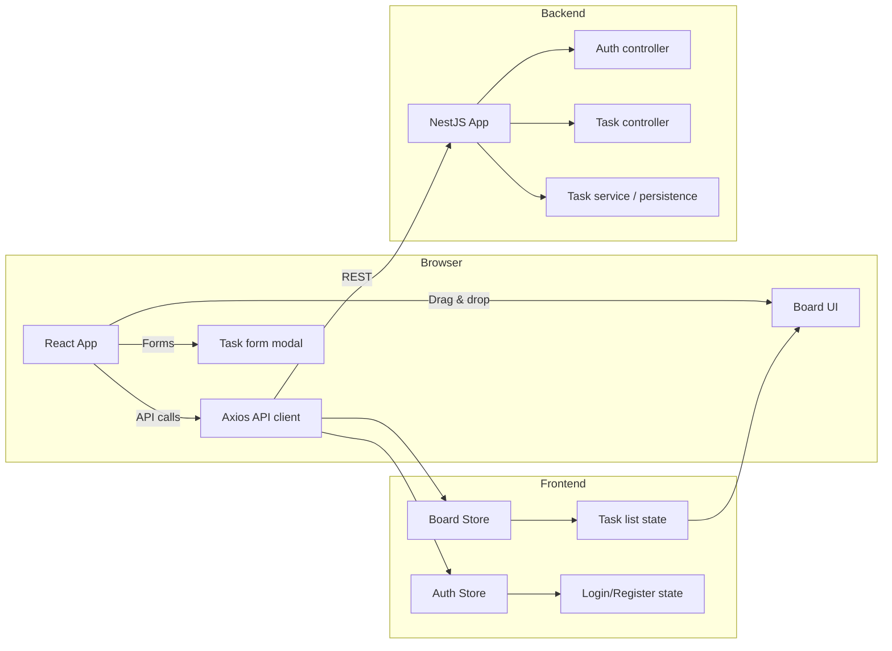

# Mini Jira

## Overview

Mini Jira is a two-part application with a React + Vite frontend and a NestJS backend.
The frontend handles routing, task board rendering, filters, and task form interactions.
The backend exposes REST APIs for authentication and task management.

## Architecture



## Improvements made

- Added route-level lazy loading for `Dashboard`, `Login`, and `Register`.
- Memoized `TaskCard` and `BoardColumn` to reduce unnecessary re-renders.
- Replaced inline query parameter keys with constants.
- Split task column definitions into a shared `board.constant.ts` constant.
- Avoided broad selector reads by selecting only needed zustand state in `TaskFormModal`.
- Added type-safe component props and explicit return types where necessary.

## Local setup

### Frontend

```bash
cd frontend
pnpm install
pnpm run dev
```

### Backend

```bash
cd backend
pnpm install
pnpm run start:dev
```

## Production notes

- Use `pnpm run build` in the frontend and `pnpm run build` in the backend before deployment.
- Ensure `VITE_API_BASE_URL` is set for the frontend.
- Persisted stores are migrated safely on version changes.
